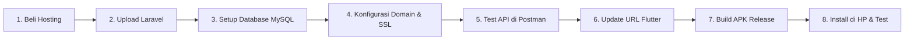

# Panduan Lengkap: Hosting Laravel + Flutter APK (Sampai Jadi)

Dokumen ini adalah panduan **step-by-step** dari awal hosting sampai Flutter app kamu siap pakai.

---

## Gambaran Besar Alur



---

## Tahap 1: Beli Hosting

### Rekomendasi Provider (Indonesia)

| Provider | Paket | Harga | Link |
|---|---|---|---|
| **Niagahoster** | Starter/Business | ~30-90rb/bulan | niagahoster.co.id |
| **Hostinger** | Premium/Business | ~25-80rb/bulan | hostinger.co.id |
| **Dewaweb** | Scout | ~25-50rb/bulan | dewaweb.com |
| **IDCloudHost** | Starter | ~15-50rb/bulan | idcloudhost.com |

### Syarat Hosting yang Diperlukan

> [!IMPORTANT]
> Pastikan hosting yang kamu beli support:
> - **PHP 8.2+** (Laravel 12 butuh ini)
> - **MySQL 5.7+** atau **MariaDB 10.3+**
> - **SSL gratis** (untuk HTTPS)
> - **SSH Access** (opsional tapi sangat membantu)
> - **Storage minimal 1GB**

### Yang Kamu Dapat Setelah Beli

Setelah pembayaran, kamu akan dapat email berisi:
- **cPanel URL** (contoh: `https://cpanel.namadomain.com`)
- **Username & password cPanel**
- **Nameserver** (untuk domain)
- **IP server**

---

## Tahap 2: Setup Domain

### Opsi A: Beli Domain Baru (~15-100rb/tahun)
- Beli di Niagahoster/Hostinger/Namecheap
- Domain `.my.id` paling murah (~15rb/tahun)
- Contoh: `blud-wisata.my.id`

### Opsi B: Pakai Subdomain Gratis dari Hosting
- Kebanyakan hosting kasih subdomain gratis
- Contoh: `blud.hostingkamu.com`

### Setting DNS (kalau beli domain terpisah)
1. Login ke tempat beli domain
2. Masuk ke **DNS Management**
3. Ganti **Nameserver** ke nameserver dari hosting kamu
4. Tunggu propagasi DNS (biasanya 1-24 jam)

---

## Tahap 3: Upload Laravel ke Hosting

### Cara 1: Upload via cPanel File Manager (Paling Gampang)

#### Step 3.1: Siapkan file di komputer

```
1. Buka folder f:\skripsiii\bellllud\
2. JANGAN upload folder vendor/ (terlalu besar, nanti install di server)
3. Compress semua file KECUALI vendor/ menjadi ZIP
```

File & folder yang perlu diupload:
```
app/
bootstrap/
config/
database/
public/
resources/
routes/
storage/
.env              ← NANTI EDIT DI SERVER
artisan
composer.json
composer.lock
composer.phar
package.json
vite.config.js
```

#### Step 3.2: Upload ke hosting

```
1. Login cPanel
2. Buka "File Manager"
3. Masuk ke folder home → biasanya /home/username/
4. Buat folder baru, misal: "laravel" 
   (Jadi path: /home/username/laravel/)
5. Upload file ZIP ke folder "laravel"
6. Extract ZIP di sana
```

> [!WARNING]
> **JANGAN upload ke `public_html` langsung!**
> Laravel punya folder `public/` sendiri yang harus di-point ke `public_html`.

#### Step 3.3: Setting public folder

Isi dari `public/` Laravel harus bisa diakses dari domain.

**Opsi A: Symlink (Jika hosting support SSH)**
```bash
# SSH ke server, lalu:
cd /home/username
rm -rf public_html
ln -s /home/username/laravel/public public_html
```

**Opsi B: Copy public + edit index.php (Jika TIDAK ada SSH)**
```
1. Copy SEMUA isi folder laravel/public/ ke public_html/
2. Edit file public_html/index.php
```

Ubah 2 baris ini di `public_html/index.php`:

```php
// SEBELUM:
require __DIR__.'/../vendor/autoload.php';
$app = require_once __DIR__.'/../bootstrap/app.php';

// SESUDAH (sesuaikan path):
require __DIR__.'/../laravel/vendor/autoload.php';
$app = require_once __DIR__.'/../laravel/bootstrap/app.php';
```

#### Step 3.4: Install dependencies via SSH atau Terminal di cPanel

**Jika ada SSH:**
```bash
cd /home/username/laravel
php composer.phar install --optimize-autoloader --no-dev
```

**Jika TIDAK ada SSH**, gunakan **cPanel Terminal** (biasanya ada di cPanel → Terminal):
```bash
cd ~/laravel
php composer.phar install --optimize-autoloader --no-dev
```

> [!NOTE]
> Kamu sudah punya `composer.phar` di project, jadi tidak perlu install Composer di server.

---

## Tahap 4: Setup Database MySQL di Hosting

### Step 4.1: Buat database di cPanel

```
1. Login cPanel
2. Buka "MySQL Databases" atau "MySQL Database Wizard"
3. Buat database baru → misal: username_bludwb
4. Buat user baru → misal: username_bluduser
5. Set password untuk user
6. Assign user ke database → pilih "ALL PRIVILEGES"
7. Catat 3 hal ini:
   - Nama database: username_bludwb
   - Username: username_bluduser  
   - Password: yang kamu buat tadi
```

### Step 4.2: Import database yang sudah ada

Kalau kamu sudah punya data di MySQL lokal:

```
1. Di komputer lokal, export database:
   - Buka phpMyAdmin lokal
   - Pilih database
   - Klik "Export" → Format SQL → Go
   - Simpan file .sql

2. Di hosting, import database:
   - Buka phpMyAdmin di cPanel
   - Pilih database yang baru dibuat
   - Klik "Import"
   - Upload file .sql tadi
   - Klik "Go"
```

### Step 4.3: Edit .env di server

Buka File Manager di cPanel, edit file `/home/username/laravel/.env`:

```env
APP_NAME="BLUD Pariwisata"
APP_ENV=production
APP_KEY=base64:XXXXXXX     ← biarkan yang sudah ada
APP_DEBUG=false              ← PENTING: false di production!
APP_URL=https://namadomain.com

DB_CONNECTION=mysql
DB_HOST=localhost            ← biasanya localhost di shared hosting
DB_PORT=3306
DB_DATABASE=username_bludwb       ← nama database di hosting
DB_USERNAME=username_bluduser     ← username di hosting
DB_PASSWORD=password_kamu         ← password yang kamu buat

MAIL_MAILER=smtp
MAIL_HOST=mail.namadomain.com
MAIL_PORT=465
MAIL_USERNAME=noreply@namadomain.com
MAIL_PASSWORD=password_email
MAIL_ENCRYPTION=ssl
MAIL_FROM_ADDRESS="noreply@namadomain.com"
MAIL_FROM_NAME="BLUD Pariwisata"
```

### Step 4.4: Jalankan migration (jika belum import SQL)

Via SSH atau cPanel Terminal:
```bash
cd ~/laravel
php artisan migrate --force
```

### Step 4.5: Buat storage link

```bash
cd ~/laravel
php artisan storage:link
```

Kalau gagal (karena symlink issue di shared hosting), buat manual:
```bash
ln -s /home/username/laravel/storage/app/public /home/username/public_html/storage
```

### Step 4.6: Set permission

```bash
chmod -R 775 /home/username/laravel/storage
chmod -R 775 /home/username/laravel/bootstrap/cache
```

---

## Tahap 5: Setup SSL (HTTPS)

### Di cPanel:
```
1. Buka "SSL/TLS" atau "Let's Encrypt SSL"
2. Pilih domain kamu
3. Klik "Issue" atau "Install"
4. Tunggu beberapa menit
5. Domain kamu sekarang bisa diakses via https://
```

### Force HTTPS (tambahkan di public_html/.htaccess):
```apache
RewriteEngine On
RewriteCond %{HTTPS} off
RewriteRule ^(.*)$ https://%{HTTP_HOST}%{REQUEST_URI} [L,R=301]
```

---

## Tahap 6: Test API di Postman

Sebelum update Flutter, pastikan API jalan di server hosting.

### Test 1: Home (Public)
``` 
GET https://namadomain.com/api/home
Expected: JSON dengan contents dan news
```

### Test 2: Register
```
POST https://namadomain.com/api/register
Headers:
  Accept: application/json
  Content-Type: application/json
Body (JSON):
{
    "name": "Test User",
    "email": "test@gmail.com",
    "password": "123456",
    "password_confirmation": "123456"
}
Expected: JSON dengan token dan user data
```

### Test 3: Login
```
POST https://namadomain.com/api/login
Headers:
  Accept: application/json
  Content-Type: application/json
Body (JSON):
{
    "email": "test@gmail.com",
    "password": "123456"
}
Expected: JSON dengan token
```

### Test 4: Profile (Authenticated)
```
GET https://namadomain.com/api/profile
Headers:
  Accept: application/json
  Authorization: Bearer TOKEN_DARI_LOGIN
Expected: JSON dengan data user
```

> [!CAUTION]
> Kalau ada error 500, cek log di `storage/logs/laravel.log` via File Manager.
> Penyebab umum: database credentials salah, missing vendor, atau permission issue.

---

## Tahap 7: Update URL di Flutter

Setelah API di hosting jalan, update URL di Flutter.

### Edit `f:\skripsiii\flutter_app\lib\core\constants\constants.dart`:

```dart
class ApiConstants {
  // GANTI DENGAN DOMAIN HOSTING KAMU
  static const String baseUrl = 'https://namadomain.com/api';
  static const String storageUrl = 'https://namadomain.com/storage';
}
```

### Test ulang di emulator/HP:
```bash
cd f:\skripsiii\flutter_app
flutter run
```

Pastikan semua fitur jalan:
- [ ] Register berhasil
- [ ] Login berhasil
- [ ] Home menampilkan data wisata & berita
- [ ] Detail wisata muncul dengan gambar
- [ ] Jadwal booking tampil
- [ ] Submit pengajuan berhasil
- [ ] Riwayat pengajuan muncul
- [ ] Profil bisa diedit
- [ ] Logout berhasil

---

## Tahap 8: Build APK Release

### Step 8.1: Siapkan signing key

```bash
cd f:\skripsiii\flutter_app

keytool -genkey -v -keystore android\app\upload-keystore.jks -storetype JKS -keyalg RSA -keysize 2048 -validity 10000 -alias upload
```

Kamu akan diminta isi:
- Password keystore → **ingat baik-baik!**
- Nama lengkap, organisasi, kota, provinsi, kode negara (ID)

### Step 8.2: Buat file key.properties

Buat file `f:\skripsiii\flutter_app\android\key.properties`:

```properties
storePassword=PASSWORD_KAMU
keyPassword=PASSWORD_KAMU
keyAlias=upload
storeFile=upload-keystore.jks
```

### Step 8.3: Edit android/app/build.gradle.kts

Tambahkan konfigurasi signing di file build gradle (biasanya sudah ada template-nya, tinggal uncomment atau tambahkan).

### Step 8.4: Build APK

```bash
cd f:\skripsiii\flutter_app
flutter build apk --release
```

### Step 8.5: Hasil APK

```
File APK ada di:
f:\skripsiii\flutter_app\build\app\outputs\flutter-apk\app-release.apk

Ukuran biasanya sekitar 15-25 MB
```

Transfer file APK ini ke HP → install → selesai! 🎉

---

## Tahap 9: Checklist Final

### Server/Hosting
- [ ] Domain aktif dan bisa diakses
- [ ] SSL/HTTPS aktif
- [ ] API endpoints bisa diakses dari Postman
- [ ] Database MySQL terkoneksi
- [ ] File upload berfungsi
- [ ] `APP_DEBUG=false` di .env production

### Flutter App
- [ ] Base URL mengarah ke domain hosting
- [ ] Register & Login berfungsi
- [ ] Semua halaman menampilkan data dari server
- [ ] Upload PDF berfungsi
- [ ] APK berhasil di-build
- [ ] APK bisa diinstall di HP

### Untuk Presentasi Skripsi
- [ ] Screenshot semua screen Flutter (untuk bab implementasi)
- [ ] Screenshot response API dari Postman (untuk bab implementasi)
- [ ] Demo live: admin tambah data di web → muncul di app Flutter
- [ ] Demo live: user submit booking di Flutter → muncul di admin web

---

## Troubleshooting Umum

### Error 500 di server
```bash
# Cek log error:
cat ~/laravel/storage/logs/laravel.log | tail -50

# Penyebab umum:
# 1. .env belum benar → cek DB credentials
# 2. vendor/ belum di-install → jalankan composer install
# 3. Permission → chmod 775 storage/ dan bootstrap/cache/
# 4. APP_KEY kosong → php artisan key:generate
```

### API return HTML bukan JSON
```
# Pastikan request punya header:
Accept: application/json

# Flutter DioClient sudah handle ini otomatis ✅
```

### Gambar/file tidak muncul
```bash
# Pastikan storage link sudah dibuat:
php artisan storage:link

# Atau buat manual:
ln -s ~/laravel/storage/app/public ~/public_html/storage
```

### Flutter gagal konek ke server
```
# Cek di Flutter:
# 1. URL benar? (https, bukan http)
# 2. Internet permission ada? (sudah default)
# 3. Server bisa diakses dari browser HP?
```

---

## Timeline Estimasi

| Tahap | Waktu |
|---|---|
| Beli hosting + domain | 30 menit |
| Upload Laravel + setup | 1-2 jam |
| Setup database | 30 menit |
| Test API | 30 menit |
| Update Flutter + test | 30 menit |
| Build APK | 15 menit |
| **Total** | **~3-5 jam** |

> [!TIP]
> Kalau kamu belum pernah hosting Laravel sebelumnya, siapkan waktu lebih (6-8 jam) karena mungkin ada trial-error pertama kali. Jangan panik kalau ada error, biasanya masalah kecil seperti typo di .env atau permission.
